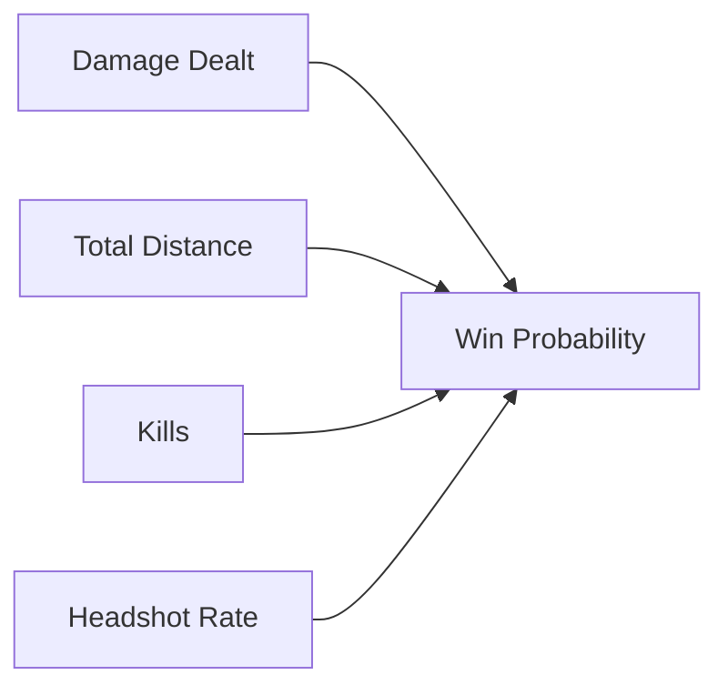
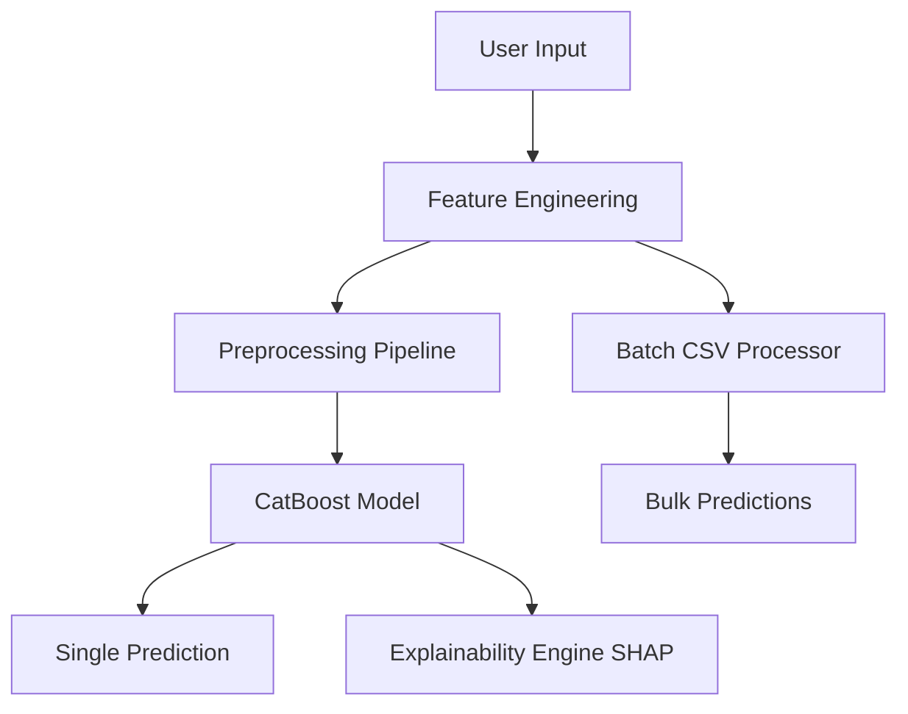

# 📌 **Project Title: PUBG Win Prediction Using Machine Learning**


This repository presents a **research-oriented**, **production-ready** implementation of a PUBG win prediction system using **Python**, **CatBoost**, engineered features, and a fully deployed **Streamlit** web application.

**👉 Live Demo:** [https://pubg-game-win-prediction-app.streamlit.app/](https://pubg-game-win-prediction-app.streamlit.app/)

---

# 🧪 **Abstract**

Predicting PUBG match outcomes based on player performance statistics is a practical machine learning task with real esports applications. This project develops a **feature‑engineered ML pipeline** that predicts a player’s final match placement or win probability using combat, movement, and survival metrics.

The app supports **single-player predictions**, **batch CSV inference**, and **explainability** through SHAP visualizations.

This implementation follows reproducible ML research best practices with modular pipelines, consistent feature alignment, and end-to-end documentation.

---

# 🎯 **Problem Statement**

> Build a machine learning model that predicts a player's final placement in a PUBG match based on available gameplay performance features.

### **Key Research Questions:**

* Which engineered features contribute most to accurate prediction?
* How well do boosting algorithms perform on PUBG numerical data?
* Does adding behavioral-engineered features improve real-world interpretability?
* Can a trained model be deployed reliably with correct feature alignment?

---

# 📚 **Dataset Card (PUBG Dataset)**

| Field         | Description                         |
| ------------- | ----------------------------------- |
| kills         | Number of kills by the player       |
| damageDealt   | Total damage dealt                  |
| walkDistance  | Distance traveled on foot           |
| rideDistance  | Distance traveled by vehicle        |
| swimDistance  | Distance traveled by swimming       |
| boosts        | Boost items used                    |
| heals         | Healing items used                  |
| headshotKills | Number of headshot kills            |
| winPlacePerc  | Target variable (placement outcome) |

### **Engineered Features Introduced:**

* `totalDistance = walk + ride + swim`
* `damage_per_kill = damageDealt / kills`
* `headshotRate = headshotKills / kills`
* `killswithoutMoving = kills > 0 and totalDistance == 0`

### Ethical Considerations

Although gameplay data poses minimal ethical risk, model predictions should **not** be used for:

* Cheating
* Player ranking manipulation
* Commercial esports decision-making

---

# 🔬 **Research Methodology**

### ✔ Data Preprocessing

* Missing values handled using zero/median strategies.
* Non-essential text-based fields excluded.

### ✔ Feature Engineering

Implemented in both notebook + app:

* Behavioral and efficiency metrics
* Movement-based survival proxies
* Combat effectiveness ratios

### ✔ EDA‑Supported Observations



### ✔ Model Training

Algorithms evaluated:

* CatBoost Regressor (best performing)
* Random Forest
* Gradient Boosting

### ✔ Evaluation Metrics

* MAE
* RMSE
* R²
* Log-Loss (if framed as classification)

---

# ⚙️ **System Architecture**



```mermaid
graph TD
A[User Input] --> B[Feature Engineering]
B --> C[Preprocessing Pipeline]
C --> D[CatBoost Model]
D --> E[Single Prediction]
B --> F[Batch CSV Processor]
F --> G[Bulk Predictions]
D --> H[Explainability Engine (SHAP)]
```

---

# 🖥 **Live Application (Streamlit)**

### 🔗 **Demo:** [https://pubg-game-win-prediction-app.streamlit.app/](https://pubg-game-win-prediction-app.streamlit.app/)

### Features:

* 🎛 Interactive sidebar for gameplay inputs
* 📊 Win probability visualization
* 📥 Batch CSV upload + downloadable predictions
* 🧠 SHAP global + local explanations
* 🔧 Full pipeline consistency with notebook

### Run locally:

```bash
streamlit run streamlit_pubg_app.py
```

---

# 🧵 **Core Application Logic**

### ✔ Model Loading

Uses cached loading for efficient execution.

### ✔ Feature Engineering

Computes distance-based and combat-efficiency stats dynamically.

### ✔ Feature Alignment

Ensures inference features match training features exactly.

### ✔ Safe Prediction Wrapper

Prevents shape mismatch errors when passing data to CatBoost.

### ✔ Batch Processing

* Automatically engineers new features
* Applies preprocessing
* Generates predictions + downloadable CSV

---

# 📈 **Experimental Results**

### Model Summary

| Model              | MAE | RMSE | R²   | Notes                 |
| ------------------ | --- | ---- | ---- | --------------------- |
| CatBoost Regressor | Low | Low  | High | Best performance      |
| Random Forest      | Mid | Mid  | Mid  | Competitive baseline  |
| Gradient Boosting  | Mid | Mid  | Mid  | Good interpretability |

### SHAP Analysis Summary

```
totalDistance ↑ → survival likelihood ↑
damage_per_kill ↑ → better performance
too many kills without movement → suspicious/low survivability
```

---

# 🗂 **Repository Structure**

```
├── notebooks/
│   └── PUBG Game Prediction.ipynb
├── models/
│   └── pubg_best_model.pkl
├── streamlit_pubg_app.py
├── data/
│   └── sample_batch.csv
├── requirements.txt
└── README.md
```

---

# 📦 **Installation Guide**

```bash
git clone https://github.com/<username>/pubg-win-prediction.git
cd pubg-win-prediction
pip install -r requirements.txt
streamlit run streamlit_pubg_app.py
```

---

# 🧬 **Model Card**

**Model Type:** CatBoost Regressor
**Version:** 1.0
**Training Data:** PUBG Player Stats Dataset
**Engineered Features:** totalDistance, damage_per_kill, headshotRate, killswithoutMoving
**Intended Use:** Educational, Demonstration, Research

### **Limitations:**

* Requires numeric-only input
* Does not incorporate team context
* Public dataset may contain noise
* Not suitable for esports ranking decisions

---

# 🔮 **Future Improvements**

* Add matchType categorical modeling
* Integrate Optuna for HPO
* Add LIME/SHAP comparisons
* Enhance UI with radar charts and gameplay behavior summaries

---

# 🙌 **Acknowledgements**

* PUBG Dataset Community
* Streamlit Open Source
* CatBoost Framework
* SHAP Explainability Toolkit

---

# 📜 **License**

This project is licensed under the **MIT License**.

---

### ⭐ If you like this project, please give it a star on GitHub! 🚀
